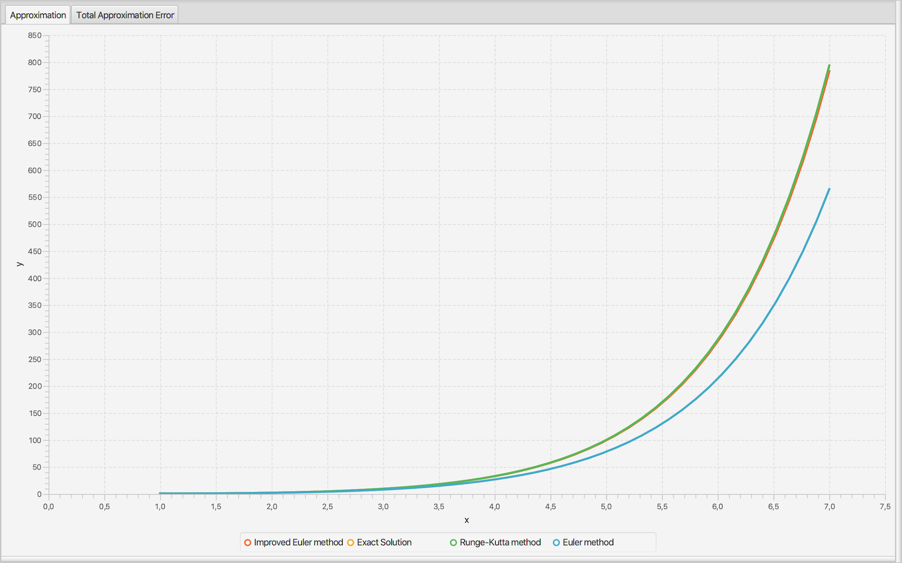

# Differential Equations. Computational Practicum.

[F20] Differential Equations. BS19-02

## Description

* Given the initial value problem with the ODE of the first order and some interval:\
y'=f(x, y)\
y(x_0)=y_0\
x belongs to (x_0; X)

* Implement the following numerical methods:
  - Euler’s method
  - improved Euler’s method
  - Runge-Kutta method

## The application

* Provides data visualization capability (charts plotting) in the user interface using JavaFX

* Constructs a corresponding approximation of the solution of a given initial value problem and the exact solution of an IVP (with the possibility of changing the initial conditions).

* Investigates the convergence of these numerical methods on different grid sizes (with the possibility of changing the number of grid steps).

* Compares approximation errors of these methods plotting the corresponding chart for different grid sizes (with the possibility of changing the range of grid steps).

### Overview

#### Approximation

#### GTE/LTE (Global/Local truncation error)

### Total Approximation Error

### UML diagram

